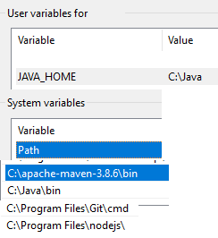

# stable-toolkit (2.3.0-luna)

 

This is an image viewer especially made to compliment [AUTOMATIC1111's web-ui](https://github.com/AUTOMATIC1111/stable-diffusion-webui). It might work with other implementations, but more testing would be required.

**_The README has been thoroughly updated as of 2.0.0-luna, please read it!_**

## Disclaimers

- _**The toolkit moves files.** I am **not** responsible for any data loss; back up your images before using the toolkit. It should not destroy anything, but setting it up wrong may cause unwanted consequences._
- _The toolkit is fully offline._
- _I do not, and will not support deletion operations. Create a "deleted" folder, move unwanted images there, and delete them manually. See this is a double confirmation for deletion._
- _If you do not follow the installation instructions precisely it is not likely you will succeed in doing it. I **highly** recommend following the instructions for **your** sake._
- _If you do not have the latest version (see above), it is not guaranteed that the instructions below will work. Please always keep the toolkit updated._

## Requirements

The below are needed to run the application. I think this includes everything, but open a ticket if you're struggling after getting them.

- [Git](https://git-scm.com/downloads) (used to download the source code)
- [MongoDB](https://www.mongodb.com/try/download/community) (used for database, compass recommended)
- [NodeJS LTS](https://nodejs.org/en/) (used to compile/run the frontend) (must be added to path)
- [Java OpenJDK **_19_**](https://jdk.java.net/java-se-ri/19) (the Windows 11 version works for Windows 10 as well) (used to run the backend) (must be added to path)
- [Maven](https://maven.apache.org/download.cgi) (used to compile backend) (must be added to path)
- [AUTOMATIC1111's SD Implementation](https://github.com/AUTOMATIC1111/stable-diffusion-webui) (the web-ui the toolkit imports images from)

## Installation

This is a one time setup after which you will be able to run the toolkit via "run-toolkit.bat". Closing the CMD will close the toolkit

1.  Check that you have everything listed under the "Requirements" header
2.  Search "environment variables"
    - Open "Edit the system environment variables"
    - Click "Environment variables..."
    - Your user/system variables should look similar to mine:
    - 
3.  Download the _download-toolkit.bat_ from above and place it where you want the toolkit to be downloaded. (It will create a new folder)
4.  Run the _update-toolkit.bat_ to update and compile the code (this can be used to update the toolkit in the future as well)
5.  You can then run _run-toolkit.bat_ to launch the toolkit and access it from *http://127.0.0.1:8801/*
6.  Use the cogwheel on the bottom right to add see the various settings, and use the weird upside down pyramid to filter your images

## Limitations

- Only .png files get processed at the moment
- If you want automatic tagging/filtering, "Save text information about generation parameters as chunks to png files" should be enabled in the web-ui

## Troubleshooting

The general troubleshooting process should go as follows, and should fix most if not all problems encountered:

1. Check if updated to the latest version (verify version in Spring CMD)
2. Re-Index images via UI (sometimes this takes a while, check the Spring CMD for info)
3. Close CMD's and restart it
   - You might need to re-index again
4. Drop your images collection from MongoDB
   - Restart and re-index

# Features in current version

If anything doesn't make sense the "Usage" section below should explain it in detail.

- Move images from directory to directory with a few clicks
- Add folders and move images between them
  - If the image has chunks in the format of the web-ui's, it will be automatically tagged
- Easily view and sort your images into different folders, or tags
  - Create your tags ("cats" or "dogs")
  - If your positive prompt has these words in it, your image will automatically be tagged with it
  - You're able to filter by these parameters:
    - Image location (folder it's in)
    - Tags
    - Sample steps
    - Sampler
    - Denoise
    - CFG
    - Model hash
    - Model
    - Face restoration
    - Hypernet
    - Clip skip
    - Image width
    - Image height
    - Image date (images created after/before a date)
- Confirm version via the _Spring_ CMD. It should match the version that's on the top of this page.
- View your images immediately after generation
- Click the image name to find it in explorer

## Verified Bugs

Generally, if you follow the steps in _Troubleshooting_, it should fix most of your problems.

- None verified as of latest release

# Usage

If you follow the steps in this section you should be able to run the toolkit with ease

## Utilities

Several utilities are available to help with sorting/managing your generated images.

### Location

These are the folders your images are in. The folder must already exist before adding it to the toolkit, as the service will not create it for you. Select individual images, or all images currently in view via the checkbox, and move them via the folder icon.

### Tags & Automatic Tagging

Your images automatically get tagged based on the information picked up from the png chunks added by stable-diffusion-webui. Currently you are able to add/remove tags, and re-index to automatically tag your images. Tags can be used to filter, and the more you add to the filter, the more your images get narrowed down.

**To use automatic tagging:**

1. Add tags you want to pick from your prompts ie "cats" or "dogs"
2. Re-index
3. Everything automatically tagged based on your prompts

### Moving

Using the checkbox selects all images, and selecting a folder from the dropdown moves any and all selected images to the folder picked. Note that because of infinite loading if you want to move mass amounts of images at the moment, you're going to have to scroll. Alternatively you can move them yourself and re-index. There will be a way to mass move in a future release.

### Settings

This is where you can see how many images are currently displayed, add/delete locations, and add/delete tags. Re-Index is quite useful when something goes wrong, or the image database needs to be remade. Try this first when something doesn't display or goes wrong.

# Releases

The latest releases can be found here. The format of releases in the case of `x.y.z` are:

- `x`: Major releases that can include redesigns/significant features/changes that might not be compatible with previous versions
- `y`: Minor releases that include new/changed/removed features, and various bug fixes
- `z`: Patch releases in-between feature rollouts typically for important bug fixes

## Luna

- 2.y.z (planned)
  - Expose settings:
    - Empty logging file (along with its current size)
    - Reset settings button
    - Switching image loaders (?) (can be done manually by editing \*\front-code\next.config.js)
  - Better support for different monitor sizes
  - Mass tagging (for tags not present in the prompt)
  - Better statistics
  - Mass moving (currently, only in-view images get moved when selecting all and moving)
  - Indexing is done via _Java Streams_ currently. Ideally this should be done through db queries to make things faster
  - Switch between images using arrows (and arrow keys)
  - The ability to dynamically add filters as desired instead of all being present by default
  - Different sorting options 
  - Better logging on back end
  - Better error handling all around, mainly front end
- 2.2.0
  - Made generation parameter parsing more efficient and robust
  - Using image ID instead of path to retrieve images, images/folders can be named anything without causing issues
  - Fixed a bug that would cause the front end to break due to the way filters were retrieved
    - Filtering after/before dates are automatically filled with the earliest/latest images' creation dates
  - Some general code cleanup
- 2.1.0
  - Updated database name (this means folders/tags might need to be re-added when updating)
  - Removed the need for Source/Index folders
  - Removed image renaming to random 16-digit number
  - Added model name (if present) to be picked up for generation information
    - Filtering via model name is also available
  - Fixed a bug where some newly generated images don't show up because they're outside of filter ranges.
    - Filters with numbers now default to 0, but function the same way
  - The image names can be clicked to open the explorer with the image selected
- 2.0.3
  - Better png image chunk parsing (previously failed at some null values)
- 2.0.2
  - Updated bat files, everything should work properly now
  - Added refresh button, click to update the UI
- 2.0.1
  - You can download as little as the _download-toolkit.bat_ file from above
    - Run it and if you have all the requirements it will download the source code
    - It will then compile the source code
    - You can run _update-toolkit.bat_ to update and recompile the toolkit
    - In consecutive runs, you should use _run-toolkit.bat_.
- 2.0.0
  - Now open source!
  - Redesigned UI with a full-screen view in mind. Should be more intuitive to navigate
  - Filter by generation parameters. Currently supporting:
    - Sample steps
    - Sampler
    - Denoise
    - CFG
    - Model hash
    - Face restoration
    - Hypernet
    - Clip skip
    - Width
    - Height
    - Image creation date
  - Folder names now the actual name of the folder, so there's no need to input them manually
    - If this turns out to be a better way to do it than manual naming I will reduce this operation from the front- to the backend
    - Otherwise, maybe give the option (?)
  - You can now view both _Source_ and _Index_ folders, and moving from a _Source_ folder to an _Index_ one renames the file to a random 16-digit number
  - Now using _MongoDB_ instead of a json file, should make things faster, and more reliable. Initial tests were run on a folder (each 3 times) of _3743_ images, and found (this probably varies from system to system, however, still promising):
    - A _79.5%_ reduction in image processing time (average of 33.28ms/img down to an average of 6.8ms/img)
    - A _97%_ reduction in storage size (average of 3782kb down to an average of 113kb). (However, please note the installation size of MongoDB)
  - Test coverage
    - Will try to improve it each release, I have manually tested as much of the functionality as I could and everything seems fine on my end, but we'll obviously see how it is with others
    - Backend (via JaCoCo) at: 40%
    - Frontend at: 0%
  - .png chunk information retrieval is now available (and the only option)
    - .png chunks supported (from web-ui only): tEXt, iTXt
  - Better image tagging, you can now use whatever words you want as your tags and the exact word will get picked up. (eg. say your prompt is _(cats:1.1)_, your tag can be anything such as _(cats:1.1)_, _cats_, _cats:_, _cats:1._ etc.. and it will get picked up) (from issue #7)
  - Usable backend only, if anyone wants to create a better/different frontend, it should be fairly straight forward API docs below
    - This also means the frontend will have a lesser load to deal with, which should help it run faster

## Miso

- 1.0.5
  - Minor bug fixes
  - Able to accept images from folders without txt files, so in theory any kind of source folder that has .pngs
  - Grids are able to be viewed and can be auto-tagged
  - Image viewer now better on all screen sizes, image is fixed in the middle. Image is responsive, so the same zoom settings should work on both grids and singles
  - Removed deleting tags from image viewing (can still do it from the drop-down), since the tags get re-added upon re-indexing. It would make more sense to remove the tag, rather than a tag from a single image.
- 1.0.4
  - Much better image tagging, and displaying positive/negative prompts as well as generation info
- 1.0.3
  - Automatic image tagging and option to manually disable it
- 1.0.2
  - Minor bug fix
- 1.0.1
  - Initial release, image viewing, moving, and tagging

## API

This section describes the API endpoints that can be used to build on the backend if desired.

### Image

#### Get image

This endpoint returns a .png file. The stored image's id will need to be provided.

##### Endpoint

```
GET /image/?id=${imageId}
```

#### Find image

Hitting this endpoint will open up explorer with the image selected.

##### Endpoint

```
GET /image/find?id=${imageId}
```

#### Get image filters

Get possible image filters and their range based on data in the database. If no images have a particular filter option/attribute, it will not be returned. For possible parameters to filter by, see above in `Features in current version`.

##### Endpoint

```
GET /image/filter
```

##### Return value

```
{
	"location": [
	    {
	      "name": "folderName1",
		  "path": "folderPath1"
	    },
	    {
	      "name": "folderName2",
	      "path": "folderPath2"
	    }
	],
	"afterDate": "2022-01-01T00:00:00.000Z", 
	"beforeDate": "2022-01-10T00:00:00.000Z",
	"tags": ["dog", "park", "cat"],
	"steps": [20, 60],
	"sampler": ["DDIM", "Euler a", "DPM2 a"],
	"denosise": ["0.5", "0.7"],
	"cfg": [6, 16],
	"modelHash": ["06c90211", "06c90210"],
	"faceRestoration": ["GFPGAN", "Codeformer" ],
	"hypernet": ["japanese_cartoon_2", "japanese_cartoon_3"],
	"clipSkip": [1, 2],
	"width": [512, 960],
	"height": [512, 1280]
}
```

#### Query images

Endpoint to query images.

- Only queries by given parameters, all fields are optional
- Images are sorted by creation date by default
- If nothing is set, every image object is returned
  - It is recommended to at least set the count to avoid large payloads

##### Endpoint

```
POST /image/filter
```

##### Request value

```
{
	"location": [
	    {
	      "name": "folderName1",
		  "path": "folderPath1"
	    },
	    {
	      "name": "folderName2",
	      "path": "folderPath2"
	    }
	],
	"count": 50,
	"tags": ["dog", "cat"],
	"steps": [20,40],
	"sampler": ["Euler a", "DDIM"],
	"denosise": [0.6, 0.7],
	"cfg": [8, 12],
	"modelHash": ["06c90210"],
	"faceRestoration": ["GFPGAN"],
	"hypernet": ["japanese_cartoon_3"],
	"clipSkip": [2, 2],
	"width": [960, 1280],
	"height": [640, 640],
	"afterDate": "2022-01-1T00:00:00.000Z",
	"beforeDate": "2022-01-10T00:00:00.000Z"
}
```

##### Return value

```
[
	{
		"id": "id1",
		"fileName": "something.png",
		"location": "path",
		"creationDate": "2022-01-01T00:00:00.000Z",
		"tags": ["dog", "park"],
		"positivePrompt": "dog playing fetch in a park",
		"negativePrompt": "cat",
		"steps": 30,
		"sampler": DDIM,
		"denosise": 0.7,
		"cfg": 10,
		"modelHash": "06c90210",
		"faceRestoration": "GFPGAN",
		"hypernet": "japanese_cartoon_3",
		"clipSkip": 2,
		"width": 960,
		"height": 640
	},
	...
]
```

#### Update images

Endpoint to update images. Returns the updated images. You are able to change tags/location.

##### Endpoint

```
PUT /image/
```

##### Request value

```
[
	{
		"id": "id1",
		"fileName": "something.png",
		"location": "path",
		"creationDate": "2022-01-01T00:00:00.000Z",
		"tags": ["dog", "in a park"],
		"positivePrompt": "dog playing fetch in a park",
		"negativePrompt": "cat",
		"steps": 30,
		"sampler": DDIM,
		"denosise": 0.7,
		"cfg": 10,
		"modelHash": "06c90210",
		"faceRestoration": "GFPGAN",
		"hypernet": "japanese_cartoon_3",
		"clipSkip": 2,
		"width": 960,
		"height": 640
	},
	...
]
```

##### Return value

```
[
	{
		"id": "id1",
		"fileName": "something.png",
		"location": "path",
		"creationDate": "2022-01-01T00:00:00.000Z",
		"tags": ["dog", "in a park"],
		"positivePrompt": "dog playing fetch in a park",
		"negativePrompt": "cat",
		"steps": 30,
		"sampler": DDIM,
		"denosise": 0.7,
		"cfg": 10,
		"modelHash": "06c90210",
		"faceRestoration": "GFPGAN",
		"hypernet": "japanese_cartoon_3",
		"clipSkip": 2,
		"width": 960,
		"height": 640
	},
	...
]
```

#### Trigger re-index

This endpoint deletes all image information from the database, triggering a re-index.

##### Endpoint

```
DELETE /image/
```

### Tags

#### Get tags

Get every tag.

##### Endpoint

```
GET /tag/
```

##### Return value

```
[
	"tag1",
	"tag2",
	...
]
```

#### Add/Edit tags

Attempting to add a tag path that already exists will overwrite the existing one. Otherwise a new one will be created. Return style is the same as the `GET /tag/` endpoint.

##### Endpoint

```
PUT /tag/
```

##### Request value

```
[
	"tag1",
	"tag2",
	...
]
```

##### Return value

```
[
	"tag1",
	"tag2",
	...
]
```

#### Remove tags

Endpoint for removing tags, if an empty array is specified, everything is deleted. Return style is the same as the `GET /tag/` endpoint, except the specified tags removed.

##### Endpoint

```
DELETE /tag/
```

##### Request value

```
[
	"tag1",
	"tag2",
	...
]
```

##### Return value

```
[
	"tag3",
	"tag4",
	...
]
```

### Folder

#### Get folders

Get every folder, regardless of type.

##### Endpoint

```
GET /folder/
```

##### Return value

```
[
	{
		"name": "folderName1",
		"path": "folderPath1",
	},
	{
		"name": "folderName2",
		"path": "folderPath2",
	},
	...
]
```

#### Add/Edit folders

Attempting to add a folder path that already exists will overwrite the existing one. Otherwise a new one will be created. Return style is the same as the `GET /folder/` endpoint.

##### Endpoint

```
PUT /folder/
```

##### Request value

```
[
	{
		"name": "folderName1",
		"path": "folderPath1",
	},
	{
		"name": "folderName2",
		"path": "folderPath2",
	},
	...
]
```

##### Return value

```
[
	{
		"name": "folderName1",
		"path": "folderPath1",
	},
	{
		"name": "folderName2",
		"path": "folderPath2",
	},
	...
]
```

#### Remove folders

Endpoint for removing folders, if no values are specified everything is deleted. Return style is the same as the `GET /folder/` endpoint, except the specified folders removed.

##### Endpoint

```
DELETE /folder/
```

##### Request value

```
[
	{
		"name": "folderName1",
		"path": "folderPath1",
	},
	{
		"name": "folderName2",
		"path": "folderPath2",
	},
	...
]
```

##### Return value

```
[
	{
		"name": "folderName3",
		"path": "folderPath3",
	},
	{
		"name": "folderName4",
		"path": "folderPath4",
	},
	...
]
```

### Setting

The available settings to configure are:

- `tags`: An array of _string_ tags that get automatically assigned on indexing

#### Get settings

An endpoint to get every setting.

##### Endpoint

```
GET /setting/
```

##### Return value

```
[
	{
		"id": "settingId1",
		"name": "settingName1",
		"value": "settingValue1",
	},
	{
		"id": "settingId2",
		"name": "settingName2",
		"value": "settingValue2",
	},
	...
]
```

#### Edit settings

Endpoint for editing settings (overwritten based on id). Return style is the same as the `GET /setting/` endpoint.

##### Endpoint

```
PUT /setting/
```

##### Request value

```
[
	{
		"id": "id1",
		"name": "newName1",
		"value": "settingValue1"
	},
	{
		"id": "id2",
		"name": "settingName2",
		"value": "newValue2"
	},
	...
]
```

##### Return value

```
[
	{
		"id": "id1",
		"name": "newName1",
		"value": "settingValue1"
	},
	{
		"id": "id2",
		"name": "settingName2",
		"value": "newValue2"
	},
	...
]
```

#### Reset settings

Endpoint for resetting settings. If no values are specified everything is reset. Return style is the same as the `GET /setting/` endpoint, except the specified settings reset.

##### Endpoint

```
DELETE /setting/
```

##### Request value

```
[
	{
		"id": "id1",
		"name": "settingName1",
		"value": "settingValue1"
	},
	{
		"id": "id2",
		"name": "settingName2",
		"value": "settingValue2"
	},
	...
]
```

##### Return value

```
true
```
