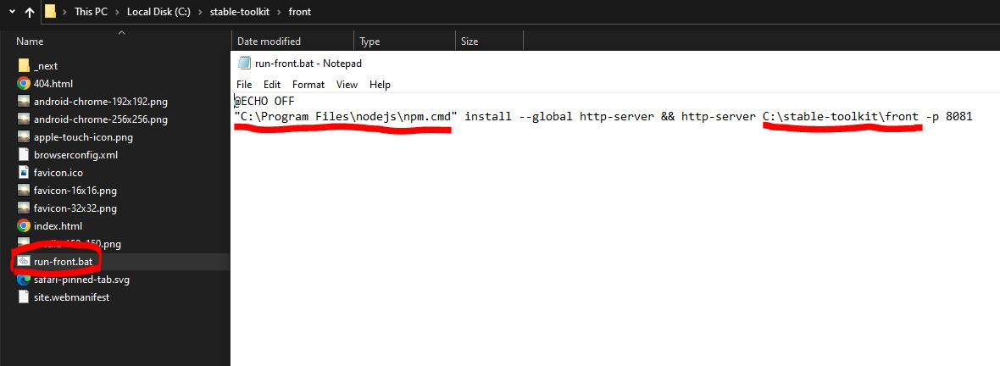
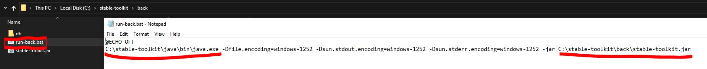
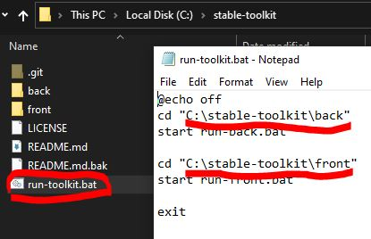
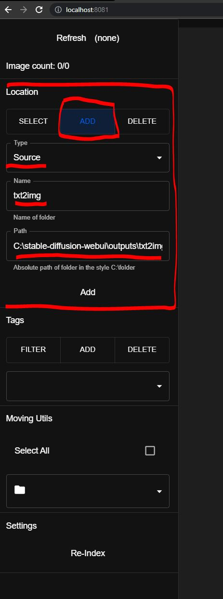
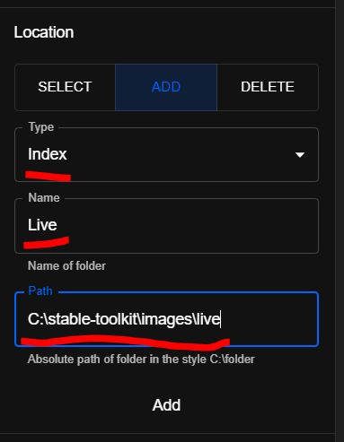

# stable-toolkit (2.0.0-luna)

 

This is an image viewer especially made to compliment [AUTOMATIC1111's web-ui](https://github.com/AUTOMATIC1111/stable-diffusion-webui). It might work with other implementations, but more testing would be required.

**_The README has been thoroughly updated as of 2.0.0-luna, please read it!_**

## Disclaimers

- **\*The toolkit moves files.** I am **not** responsible for any data loss, back up your images before using the toolkit. It should not destroy anything, but setting it up wrong may cause unwanted consequences.\*
- _The toolkit is fully offline._
- _I do not, and will not support deletion operations. Create a "deleted" folder, move unwanted images there, and delete them manually. See this is a double confirmation for deletion._
- _If you do not follow the installation instructions precisely it is not likely you will succeed in doing it. I **highly** recommend following the instructions for **your** sake._
- _If you do not have the latest version (see above), it is not guaranteed that the instructions below will work. Please always keep the toolkit updated._

## Requirements

The below are needed to run the application. I think this includes everything, but open a ticket if you're struggling after getting them.

- [Git](https://git-scm.com/downloads) (used to download the source code)
- [MongoDB](https://www.mongodb.com/try/download/community) (used for db, compass recommended)
- [NodeJS LTS](https://nodejs.org/en/) (used to run the frontend)
- [Java OpenJDK **_19_**](https://jdk.java.net/java-se-ri/19) (the Windows 11 version works for Windows 10 as well) (used to run the backend)
- [AUTOMATIC1111's SD Implementation](https://github.com/AUTOMATIC1111/stable-diffusion-webui) (the web-ui the toolkit imports images from)

## Constraints

- Only .png files get processed at the moment
- "Save text information about generation parameters as chunks to png files" _must_ be enabled in the web-ui to use automatic tagging and save prompt parameters

## Troubleshooting

The general troubleshooting process should go as follows, and should fix most if not all problems encountered:

1. Check if updated to the latest version (verify version in Spring CMD)
2. Re-Index images via UI (sometimes this takes a while, check the Spring CMD for info)
3. Close CMD's and restart it
   - You might need to re-index again
4. Drop your images collection from MongoDB
   - Restart and re-index

# Features in current version

If anything doesn't make sense the "Usage" section below should explain it in detail.

- Move images from directory to directory with a few clicks
- Add folders and move images between them
  - _Source_ type folders are typically the output folders of the web-ui. (eg. _\web-ui\outputs\img2img-images_)
  - _Index_ type folders are typically your own defined folders.
  - Moving from a _Source_ type folder to an _Index_ type folder will randomize the image's name
  - Works with any folder that has .png files in it
  - If the image has chunks in the format of the web-ui's, your images can get automatically tagged
- Easily view and sort your images into different folders, or tags
  - Create your tags ("cats" or "dogs")
  - If your positive prompt has these words in it, your image will automatically be tagged with it
  - Additionally, you're able to sort by image generation parameters
- Confirm version via the _Spring_ CMD. It should match the version that's on the top of this page.
- View your images immidiately after generation

## Known Bugs

Generally, if you follow the steps in _Troubleshooting_, it should fix most of your problems.

- None known as of 2.0.0-luna release

## Releases

The latest releases can be found here. The format of releases in the case of `x.y.z` are:

- `x`: Major releases that can include redesigns/significat features/changes that might not be compatible with previous versions
- `x`: Minor releases that include new/changed/removed features, and various bug fixes
- `x`: Patch releases inbetween feature rollouts typically for important bug fixes

### Luna 2.x.x

- 2.x.x
  - Automatic aeshetic scoring/sorting (?)
  - Prompt generator (output can be read via using the web-ui script, see the files above, place it in the _\web-ui\scripts_ folder)
    - You can name/save/export/import your and others' prompt generation settings
    - Prompt boxes and sliders for generating a text file with random values.
    - Place **_.txt_** files into _\stable-toolkit\back\db\wildcards_ with the file name of the wildcard you want to use. (eg. "numbers.txt")
    - The possible prompts should be separated by line. If you are still unsure how it should look, check the example file at _\stable-toolkit\back\db\wildcards\numbers.txt_
    - When creating your prompts you can use the format \_\_numbers\_\_ to represent prompts you want to randomize.
      - You can still use the same nomenclature you use in the web-ui (eg. _(\_\_dogTypes\_\_\:1.15)_ will mean that _dogTypes_ will be replaced with prompts from your _dogTypes.txt_ file)
      - You can do _(persian cat:0.9|1.2)_ to indicate that this should be replaced with a random number between _0.9_ and _1.2_
    - Compile existing prompts in a folder to a text file
    - You are able to generate the same exact prompt x number of times, up to the whole prompts/settings being random
  - Expose settings:
    - Maximum and minimum limits for each of the prompt generator settings
    - Empty logging file (along with it's current size)
    - Empty logs on Re-Index (off by default, not recommended as logs are very useful in finding bugs, but it's an option for those who are confident)
    - Reset settings button
    - Switching image loaders (?) (can be done manually by editing \*\front-code\next.config.js)
  - Automatic aeshetic scoring/sorting (?)
  - Better support for different monitor sizes
  - Mass tagging
  - Better statistics
- 2.1.0
  - Indexing is done via *Java Stream*s currently. Ideally this should be done through db queries to make things faster.
  - Switch between images using arrows (and arrow keys)
  - You can download as little as the _download-toolkit.bat_ file from above
    - Run it and if you have all the requirements it will download the source code
    - It will then compile the source code
    - And finally run the back- and frontend
    - You can run _compile-toolkit.bat_ to recompile the toolkit
    - In consecutive run, you should use _run-toolkit.bat_. It will tell you if your files have been updated or not. If yes, please run _compile-toolkit.bat_. (If someone is smart enough to merge _compile-toolkit.bat_ and _run-toolkit.bat_ the help would be appreciated)
  - Dropdowns for drawer sections
- 2.0.0
  - Now open source!
  - Redesigned UI with a full-screen view in mind. Should be more intuitive to navigate
  - Filter by generation parameters. Currently supporting:
    - Sample steps
    - Sampler
    - Denoise
    - CFG
    - Model hash
    - Face restoration
    - Hypernet
    - Clip skip
    - Width
    - Height
    - Image creation date
  - Folder names now the actual name of the folder, so there's no need to input them manually
    - If this turns out to be a better way to do it than manual naming I will reduce this operation from the front- to the backend
    - Otherwise maybe give the option (?)
  - You can now view both _Source_ and _Index_ folders, and moving from a _Source_ folder to an _Index_ one renames the file to a random 16 digit number
  - Now using _MongoDB_ instead of a json file, should make things faster, and more reliable. Initial tests were run on a folder (each 3 times) of _3743_ images, and found (this probably varies from system to system, however, still promising):
    - A _79.5%_ reduction in image processing time (average of 33.28ms/img down to an average of 6.8ms/img)
    - A _97%_ reduction in storage size (average of 3782kb down to an average of 113kb). (However, please note the installation size of MongoDB)
  - Test coverage
    - Will try to improve it each release, I have manually tested as much of the functionality as I could and everything seems fine on my end, but we'll obviously see how it is with others
    - Backend (via JaCoCo) at: 40%
    - Frontend at: 0%
  - .png chunk information retreival is now available (and the only option)
    - .png chunks supported (from web-ui only): tEXt, iTXt
  - Better image tagging, you can now use whatever words you want as your tags and the exact word will get picked up. (eg. say your prompt is _(cats:1.1)_, your tag can be anything such as _(cats:1.1)_, _cats_, _cats:_, _cats:1._ etc.. and it will get picked up) (from issue #7)
  - Usable backend only, if anyone wants to create a better/different frontend, it should be fairly straight forward API docs below
    - This also means the frontend will have a lesser load to deal with, which should help it run faster

### Miso 1.x.x

- 1.0.5
  - Minor bug fixes
  - Able to accept images from folders without txt files, so in theory any kind of source folder that has .pngs
  - Grids are able to be viewed and can be auto-tagged
  - Image viewer now better on all screen sizes, image is fixed in the middle. Image is responsive, so the same zoom settings should work on both grids and singles
  - Removed deleting tags from image viewing (can still do it from the drop-down), since the tags get re-added upon re-indexing. It would make more sense to remove the tag, rather than a tag from a single image.
- 1.0.4
  - Much better image tagging, and displaying positive/negative prompts as well as generation info
- 1.0.3
  - Automatic image tagging and option to manually disable it
- 1.0.2
  - Minor bug fix
- 1.0.1
  - Initial release, image viewing, moving, and tagging

# Usage

If you follow the steps in this section you should be able to run the toolkit with ease

## Installation

This is a one time setup after which you will be able to run the toolkit via "run-toolkit.bat". Closing the CMD will close the toolkit

1.  Check that you have everything listed under the "Requirements" header
2.  Open front\run-front.bat with Notepad or alternative, and replace "C:\Program Files\nodejs\npm.cmd" -> your npm installation (_with quotes_). If it's default, it will most likely be the same, but double check. Change C:\stable-toolkit\front -> wherever you put your toolkit\front folder (_without quotes_). **MAKE SURE TO SAVE YOUR CHANGES**



3.  Open back\run-back.bat with Notepad or alternative, and replace C:\stable-toolkit\java\bin\java.exe -> your Java installation (_without quotes_). Then replace C:\stable-toolkit\back\stable-toolkit.jar -> wherever you put the toolkit\back\stable-toolkit.jar (_without quotes_) **MAKE SURE TO SAVE YOUR CHANGES**



5.  Open run-toolkit.bat and replace "C:\stable-toolkit\back" -> wherever you put your toolkit\back folder, and replace "C:\stable-toolkit\front" -> wherever you put your toolkit\front folder (_both with quotes_) **MAKE SURE TO SAVE YOUR CHANGES**



7.  Run _run-toolkit.bat_. This will run the back- and frontend. The backend will automatically populate the db with some default values. The frontend will install the npm [http-server](https://www.npmjs.com/package/http-server) module, and run the server. This will be available for you at **localhost:8081**.
8.  Once you access **localhost:8081**, you need to do two things: - Switch to Location -> Add, and add a _Source_ type folder. This will be your stable diffusion folder, for example C:\stable-diffusion-webui\outputs\txt2img-images. You can name it whatever you like, such as "txt2img". When clicking _Refresh_ this is the folder that the toolkit will read from, and move your files. **THE FOLDER MUST EXIST, THE TOOLKIT WILL NOT CREATE IT**
    
    - Add an _Index_ type folder. This will be where the processed files get moved. The actual name of the folder doesn't matter, but the name given in the _Name_ text field should be **Live**. This is hardcoded for now, should be updated in the future. An example for a folder path could be C:\stable-toolkit\images\live **THE FOLDER MUST EXIST, THE TOOLKIT WILL NOT CREATE IT**
      
9.  After adding the two folders, you should see a green number beside the refresh button. This is how many images you have in the _Source_ folders (you can add multiple). If this is not the case, refresh the page. Click refresh, and it should move all files from your _Source_ folders -> _Live_ folder. This point is the main loop of application usage. You will need to manually press _Refresh_ every time you want to import your images. _Note: the main reason why this isn't done automatically is because there is no way for the toolkit to know when an image if being written to file. Therefore it could happen that the toolkit tries to copy a file currently being written to by stable-diffusion-webui resulting in a broken image._

## Utilities

Several utilities are available to help with sorting/managing your generated images.

### Location

These are the folders your images are in. You are able to add new folders and remove them. There are 2 types of folders: _Source_ and _Index_. _Source_ folders are where your generated images get output to, this should ideally be coming from stable-diffusion-webui\outputs\[folder-name]. _Index_ folders are user defined folders, and moving an image from a _Source_ folder to an _Index_ folder will randomize the image's name. Select individual images, or all images currently in view via the checkbox, and move them via the folder icon.

### Tags & Automatic Tagging

Your images automatically get tagged based on the information picked up from the png chunks added by stable-diffusion-webui. Currently you are able to add/remove tags, and re-index to automatically tag your images. Tags can be used to filter, and the more you add to the filter, the more your images get narrowed down.

**To use automatic tagging:**

1. Add tags you want to pick from your prompts ie "cats" or "dogs"
2. Re-index
3. Everything automatically tagged based on your prompts

### Moving

Using the checkbox selects all images, and selecting a folder from the dropdown moves any and all selected images to the folder picked. Note that because of infinite loading if you want to move mass amounts of images at the moment, you're going to have to scroll. Alternatively you can move them yourself and re-index. There will be a way to mass move in a future release.

### Settings

This is where you can see how many images are currently displayed, add/delete locations, and add/delete tags. Re-Index is quite useful when something goes wrong, or the image db needs to be remade. Try this first when something doesn't display or goes wrong.

## API

This section descibes the API endpoints that can be used to build on the backend if desired.

### Image

#### Get image

This endpoint returns a .png file. This url can be local or otherwise, however you'll need to update the next.js config if you want to make it non-local.

##### Endpoint

```
GET /image/?url=${imageUrl}
```

#### Get image filters

Get possible image filters and their range based on data in the database.

##### Endpoint

```
GET /image/filter
```

##### Return value

```
{
	"location": ["path", "path2"],
	"creationDate": ["2022-01-01T00:00:00.000Z", ["2022-01-10T00:00:00.000Z"],
	"tags": ["dog", "park", "cat"],
	"steps": [20, 60],
	"sampler": ["DDIM", "Euler a", "DPM2 a"],
	"denosise": ["0.5", "0.7"],
	"cfg": [6, 16],
	"modelHash": ["06c90211", "06c90210"],
	"faceRestoration": ["GFPGAN", "Codeformer" ],
	"hypernet": ["japanese_cartoon_2", "japanese_cartoon_3"],
	"clipSkip": [1, 2],
	"width": [512, 960],
	"height": [512, 1280]
}
```

#### Query images

Endpoint to query images. Optional query parameters can be sent:

- Only queries by given parameters, all fields are optional
- If nothing is set, every image object is returned
  - It is recommended to at least set the count to avoid large payloads

##### Endpoint

```
POST /image/filter
```

##### Request value

```
{
	"location": "path",
	"count": 50,
	"tags": ["dog", "cat"],
	"steps": [20,40],
	"sampler": ["Euler a", "DDIM"],
	"denosise": [0.6, 0.7],
	"cfg": [8, 12],
	"modelHash": ["06c90210"],
	"faceRestoration": ["GFPGAN"],
	"hypernet": ["japanese_cartoon_3"],
	"clipSkip": [2, 2],
	"width": [960, 1280],
	"height": [640, 640],
	"afterDate": ["2022-01-10T00:00:00.000Z"],
	"beforeDate": ["2022-01-01T00:00:00.000Z"]
}
```

##### Return value

```
[
	{
		"id": "id1",
		"fileName": "something.png",
		"location": "path",
		"creationDate": "2022-01-01T00:00:00.000Z",
		"tags": ["dog", "park"],
		"positivePrompt": "dog playing fetch in a park",
		"negativePrompt": "cat",
		"steps": 30,
		"sampler": DDIM,
		"denosise": 0.7,
		"cfg": 10,
		"modelHash": "06c90210",
		"faceRestoration": "GFPGAN",
		"hypernet": "japanese_cartoon_3",
		"clipSkip": 2,
		"width": 960,
		"height": 640
	},
	...
]
```

#### Update images

Endpoint to update images. Returns the updated images. You are able to change tags/location. If a file that doesn't confrom to naming standards (defaulted to a 16 digit number) is being moved, the file will be renamed.

##### Endpoint

```
PUT /image/
```

##### Request value

```
[
	{
		"id": "id1",
		"fileName": "something.png",
		"location": "path",
		"creationDate": "2022-01-01T00:00:00.000Z",
		"tags": ["dog", "in a park"],
		"positivePrompt": "dog playing fetch in a park",
		"negativePrompt": "cat",
		"steps": 30,
		"sampler": DDIM,
		"denosise": 0.7,
		"cfg": 10,
		"modelHash": "06c90210",
		"faceRestoration": "GFPGAN",
		"hypernet": "japanese_cartoon_3",
		"clipSkip": 2,
		"width": 960,
		"height": 640
	},
	...
]
```

##### Return value

```
[
	{
		"id": "id1",
		"fileName": "something.png",
		"location": "path",
		"creationDate": "2022-01-01T00:00:00.000Z",
		"tags": ["dog", "in a park"],
		"positivePrompt": "dog playing fetch in a park",
		"negativePrompt": "cat",
		"steps": 30,
		"sampler": DDIM,
		"denosise": 0.7,
		"cfg": 10,
		"modelHash": "06c90210",
		"faceRestoration": "GFPGAN",
		"hypernet": "japanese_cartoon_3",
		"clipSkip": 2,
		"width": 960,
		"height": 640
	},
	...
]
```

#### Trigger re-index

This endpoint deletes all image information from the database, triggering a re-index.

##### Endpoint

```
DELETE /image/
```

### Tags

#### Get tags

Get every tag.

##### Endpoint

```
GET /tag/
```

##### Return value

```
[
	"tag1",
	"tag2",
	...
]
```

#### Add/Edit tags

Attempting to add a tag path that already exists will overwrite the existing one. Otherwise a new one will be created. Return style is the same as the `GET /tag/` endpoint.

##### Endpoint

```
PUT /tag/
```

##### Request value

```
[
	"tag1",
	"tag2",
	...
]
```

##### Return value

```
[
	"tag1",
	"tag2",
	...
]
```

#### Remove tags

Endpoint for removing tags, if an empty array is specified, everything is deleted. Return style is the same as the `GET /tag/` endpoint, except the specified tags removed.

##### Endpoint

```
DELETE /tag/
```

##### Request value

```
[
	"tag1",
	"tag2",
	...
]
```

##### Return value

```
[
	"tag3",
	"tag4",
	...
]
```

### Folder

#### Get folders

Get every folder, regardless of type.

##### Endpoint

```
GET /folder/
```

##### Return value

```
[
	{
		"name": "folderName1",
		"path": "folderPath1",
		"type": "SOURCE"
	},
	{
		"name": "folderName2",
		"path": "folderPath2",
		"type": "INDEX"
	},
	...
]
```

#### Add/Edit folders

Attempting to add a folder path that already exists will overwrite the existing one. Otherwise a new one will be created. Return style is the same as the `GET /folder/` endpoint.

##### Endpoint

```
PUT /folder/
```

##### Request value

```
[
	{
		"name": "folderName1",
		"path": "folderPath1",
		"type": "SOURCE"
	},
	{
		"name": "folderName2",
		"path": "folderPath2",
		"type": "INDEX"
	},
	...
]
```

##### Return value

```
[
	{
		"name": "folderName1",
		"path": "folderPath1",
		"type": "SOURCE"
	},
	{
		"name": "folderName2",
		"path": "folderPath2",
		"type": "INDEX"
	},
	...
]
```

#### Remove folders

Endpoint for removing folders, if no values are specified everything is deleted. Return style is the same as the `GET /folder/` endpoint, except the specified folders removed.

##### Endpoint

```
DELETE /folder/
```

##### Request value

```
[
	{
		"name": "folderName1",
		"path": "folderPath1",
		"type": "SOURCE"
	},
	{
		"name": "folderName2",
		"path": "folderPath2",
		"type": "INDEX"
	},
	...
]
```

##### Return value

```
[
	{
		"name": "folderName3",
		"path": "folderPath3",
		"type": "INDEX"
	},
	{
		"name": "folderName4",
		"path": "folderPath4",
		"type": "INDEX"
	},
	...
]
```

### Setting

The available settings to configure are:

- `tags`: An array of _string_ tags that get automatically assigned on indexing

#### Get settings

An endpoint to get every setting.

##### Endpoint

```
GET /setting/
```

##### Return value

```
[
	{
		"id": "settingId1",
		"name": "settingName1",
		"value": "settingValue1",
	},
	{
		"id": "settingId2",
		"name": "settingName2",
		"value": "settingValue2",
	},
	...
]
```

#### Edit settings

Endpoint for editing settings (overwritten based on id). Return style is the same as the `GET /setting/` endpoint.

##### Endpoint

```
PUT /setting/
```

##### Request value

```
[
	{
		"id": "id1",
		"name": "newName1",
		"value": "settingValue1"
	},
	{
		"id": "id2",
		"name": "settingName2",
		"value": "newValue2"
	},
	...
]
```

##### Return value

```
[
	{
		"id": "id1",
		"name": "newName1",
		"value": "settingValue1"
	},
	{
		"id": "id2",
		"name": "settingName2",
		"value": "newValue2"
	},
	...
]
```

#### Reset settings

Endpoint for resetting settings. If no values are specified everything is reset. Return style is the same as the `GET /setting/` endpoint, except the specified settings reset.

##### Endpoint

```
DELETE /setting/
```

##### Request value

```
[
	{
		"id": "id1",
		"name": "settingName1",
		"value": "settingValue1"
	},
	{
		"id": "id2",
		"name": "settingName2",
		"value": "settingValue2"
	},
	...
]
```

##### Return value

```
true
```
